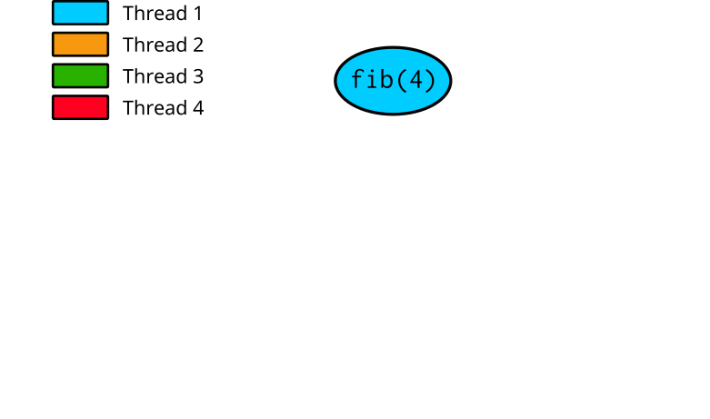
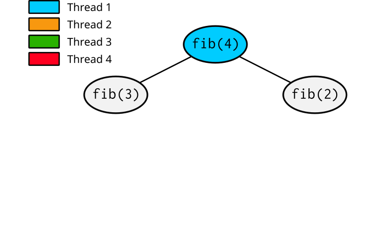
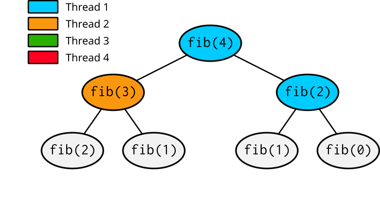
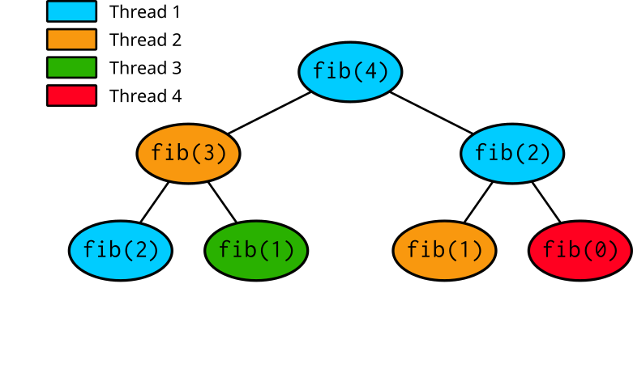
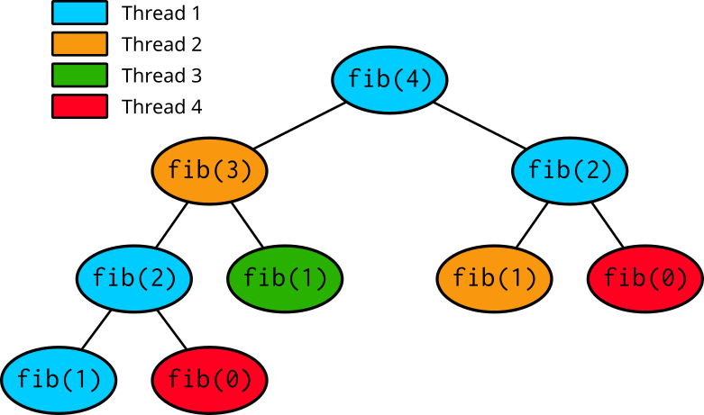

# Introduction to task based parallelism {.section}

# Worksharing Review

- Parallel regions are created by forking  a team of threads.
- `omp for/omp do`  constructs are placed inside parallel regions.
    - The loop iterations are partitioned.
    - Each thread has its own data enviroment.
    - Program executions pauses until all threads reached the end of the parallel region .


<div class="column">
```c
#pragma omp parallel for schedule(static)
 {for(i=0;i<n;i++) 
      foo(...,i);}
```
</div>
<div class="column">
```fortran
!$omp parallel do schedule(static)
  do i=1,n; foo(...,i); enddo
!$omp end parallel do
```

# Pros

- Easy to implement for loop-based parallelism where iterations can be evenly distributed across threads.
- Ideal for situations where the workload is uniform, such as in simple loops with predictable iteration counts.
- OpenMP provides different automatic load balancing via scheduling options (static, dynamic) to balance the load across threads, improving performance when work distribution is uneven.
- `#pragma omp for/!$omp do` have very low overhead.

# Limitations

- `omp for/omp do` is not well-suited for recursive algorithms  or irregular parallelism.
- The implicit barriers at the end of the loop can cause delays, especially if some threads finish their work much earlier than others.
- The developer has less control over the execution order and the distribution of work compared to tasking.
   - There is only First In, First Out (FIFO) queue available,  i.e no dependencies.

# `omp sections` 
- Before OpenMP 3.0, the only way was using **sections** construct.
 


<div class="column">
```c
#pragma omp parallel
#pragma omp sections
{
    #pragma omp section  
    {
        foo_1(...); 
    }
    #pragma omp section  
    {
        foo_2(...); 
    }
}

...
```
</div>
<div class="column">
```fortran
!$omp parallel 
!$omp sections

    !$ omp section  

        foo_1(...)

    !$omp section  

        foo_2(...)

!$omp end sections
!$omp end parallel 
```
</div>

# Terminology 

 - A **task** is specific instance of *executable code*, *its data environment*.

 - `#pragma omp for/!$omp do` creates `OMP_NUM_THREADS` **implicit task**s.

<div class="column">
```c
#pragma omp parallel for schedule(static)
 {for(i=0;i<n;i++) 
      foo(...,i);}
```
</div>
<div class="column">
```fortran
!$omp parallel do schedule(static)
  do i=1,n; foo(...,i); enddo
!$omp end parallel do
```
</div>

 - **Explicit task**s are tasks which not an **implicit task**s.
    - They are created by user via constructs (task., taskloop, target task).
      - Use **omp task [clause[[,] clause]...]** construct.

# Execution model

 - Create a parallel region which forks a team of threads. 
 
 - Tasks can be created by a single thread or several.
    - Each execution of a task construct generates a new task.
 - Tasks can be nested. 
 - Tasks may be executed *immediate*ly or can be *deffered*.
    - The runtime decides when.
 - Synchronisation between tasks is done via implicit or explicit barriers.
 - All threads in the parallel region can execute tasks. 


# Basic Tasking


<div class="column">
```c
#pragma omp parallel 
#pragma omp masked // or single
while(condition){
      #pragma omp task [clause[[,] clause]...]
        foo(...,i);  
    }


  
```
</div>
<div class="column">
```fortran
!$omp parallel 
!$omp masked ! or single
do while(condition)
      !$omp task [clause[[,] clause]...]
        foo(...,i);
      !$omp end task
enddo
!$omp end masked
!$omp end parallel
```
</div>

# Task clauses

<div class="column">
 - private(list)
 - firstprivate(list)
 - shared(list)
 - default(shared|none)
 - in-reduction(red-op:list)
 - allocate([allocator:]:list)
 - detach(event-handler)
</div>
<div class="column">
- if(expression)
- mergeable
- final(scalar-expression)
- depend(dep-type:list)
- untied
- priority(value)
- affinity(list)
</div>

# Data environment of a task
 - **Local variables are private**
 - **Static and global variables are shared**
 - *private* variables are inherited as *firsprivate*
 - *shared* attribute is inherited. 
 - *default(none)* requires each variable to have an attribute

# Tasks Synchronization: **taskwait**

<div class="column">
```c
  #pragma omp parallel
  #pragma omp single
  {
    #pragma omp task 
    modify_data(X) // Task A
    #pragma omp task 
    modify_data(Y) // Task B

    #pragma omp taskwait //The execution pauses here

    #pragma omp task 
    print_results(X) // Task C

    #pragma omp task 
    print_results(Y) // Task D
}
```
</div>
<div class="column">
```fortran
  !$omp parallel
  !$omp single
    !$omp task 
        modify_data(X) ! Task A
    !$omp end task
    !$omp task 
        modify_data(Y) ! Task B
    !$omp end task
    !$omp taskwait ! The execution pauses here
    !$omp task 
        print_results(X) ! Task C
    !$omp end task
    !$omp task 
        print_results(Y) // Task D
    !$omp end task
    ...
```
</div>


# Recursive algorithms with tasks

- A task can itself generate new tasks
    - Useful when parallelising recursive algorithms
- Recursive algorithm for Fibonacci numbers:
  $F_0=0, \quad F_1=1, \quad F_n = F_{n-1} + F_{n-2}$

<div class=column>
```c
#pragma omp parallel
{
    #pragma omp single
    fib(10);
}
```
</div>

<div class=column>
```c
int fib(int n) {
    int fn, fnm;
    if (n < 2)
        return n;
    #pragma omp task shared(fn)
    fn = fib(n-1);
    #pragma omp task shared(fnm)
    fnm = fib(n-2);
    #pragma omp taskwait
    return fn+fnm;
}
```
</div>

# Tasking illustrated

<div class=column>
- Thread 1 enters `fib(4)`
</div>

<div class=column>
{.center width=90%}
</div>

# Tasking illustrated

<div class=column>
- Thread 1 enters `fib(4)`
- Thread 1 creates tasks for `fib(3)` and `fib(2)`
</div>

<div class=column>
{.center width=90%}
</div>

# Tasking illustrated

<div class=column>
- Thread 1 enters `fib(4)`
- Thread 1 creates tasks for `fib(3)` and `fib(2)`
- Threads 1 and 2 execute tasks from the queue and create four new tasks
</div>

<div class=column>
{.center width=90%}
</div>

# Tasking illustrated

<div class=column>
- Thread 1 enters `fib(4)`
- Thread 1 creates tasks for `fib(3)` and `fib(2)`
- Threads 1 and 2 execute tasks from the queue and create four new tasks
- Threads 1-4 execute tasks
</div>

<div class=column>
{.center width=90%}
</div>

# Tasking illustrated

<div class=column>
- Thread 1 enters `fib(4)`
- Thread 1 creates tasks for `fib(3)` and `fib(2)`
- Threads 1 and 2 execute tasks from the queue and create four new tasks
- Threads 1-4 execute tasks
- ...
</div>

<div class=column>
{.center width=90%}
</div>

# Summary

 - Worksharing with `omp for/omp do` is simple and fast, but not suitable  recursive algorithms  or irregular parallelism.
 - Tasks are independent units of work with their own data environments. Implicit tasks are created by parallel loops, while explicit tasks are user-defined.
 - Tasks can be executed immediately or deferred. Synchronization is via implicit or explicit barries (**taskwait**).
 - Brute force Fibonacci series calculation.