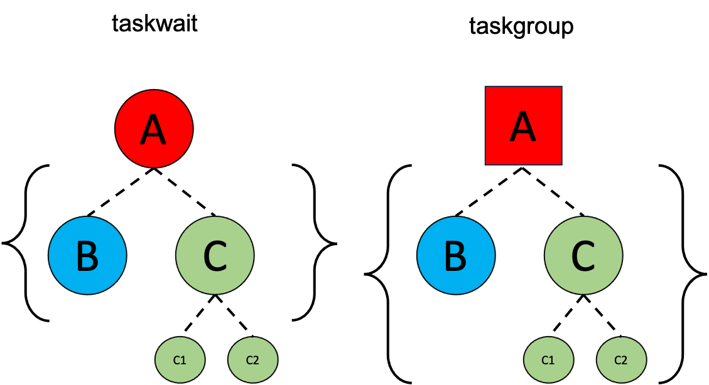

# Advanced Tasking Strategies {.section}


# Tasks 

 - Pros
    - Tasks be used to implement recursive algorithms  or irregular parallelism.
    - Tasks can be created by a thread and executed by others.
    - By default tasks have no implicit barriers. 
    - The developer has control over the execution and scheduling. 
 - Cons:
    - Creating and managing tasks at runtime incurs high overhead.
    - Task-based parallelism code is more complex.

# Tasking use case: **saxpy** 

<div class="column">
```c
#pragma omp parallel
#pragma omp single
for (int i = 0; i < n; i++) {
    #pragma omp task
    Y[i]=a*X[i]+Y[i];
}
```
</div>
<div class="column">
```fortran
!$omp parallel
!$omp single
 do i=1,n
    !$omp task
      Y(i)=a*X(i)+Y(i)
    !$omp end task
enddo
!$omp end single
!$omp end parallel
```
</div>

- The partition is too fine-grained.
- The overhead of creating tasks will cancel the gain from parallelism.

# Manual blocking

<div class="column">
```c
#pragma omp parallel
#pragma omp single
for ( i = 0; i<n; i+=TS) {
  i_end = n < (i+TS)?n:i+TS;
  #pragma omp task private(ii,i,i_end)
  for(ii=i; i<i_end;ii++) {
    Y[ii]=a*X[ii]+Y[ii];
  }  
}
```
</div>
<div class="column">
```fortran
!$omp parallel
!$omp single
do i=1,n,TS 
   i_end = MIN(n, i + TS-1)
   !$omp task private(ii,i,i_end)
   do ii=i,i_end
      Y(ii)=a*X(ii)+Y(ii)
   enddo
   !$omp end task
enddo
!$omp end single
!$omp end parallel
```
</div>

 - Problem solved, but too much work.

# The **taskloop** construct

<div class="column">
```c
#pragma omp parallel
#pragma omp single
#pragma omp taskloop grainsize(TS)
for (int i = 0; i < n; i++) {
    Y[i]=a*X[i]+Y[i];
}
```
</div>
<div class="column">
```fortran
!$omp parallel
!$omp single
!$omp taskloop grainsize(TS)
do i=1,n
      Y(i)=a*X(i)+Y(i)
enddo
!$omp end taskloop
!$omp end single
!$omp end parallel
```
</div>

- The tasks are part of an implicit taskgroup region (unless *nogroup* is specified). 
- The order of the creation of the loop tasks is unspecified. 
- Each thread encountering **taskloop** will a create set of tasks.

# Tasksloop clauses

<div class="column">
 - private(list)
 - firstprivate(list)
 - shared(list)
 - default(sh|pr|fpr|none)
 - in-reduction(red-op:list)
 - grainsize(size)
 - num_tasks(num-tasks)
</div>
<div class="column">
- if(expression)
- mergeable
- final(scalar-expression)
- untied
- priority(value)
- collapse(n)
- nogroup
- allocate([allocator:]:list)
</div>

# Task synchronization: **barrier**
 - `omp barrier` 
    - All tasks created by any thread of the current team are guaranteed to be completed at barrier exit.
    - Some constructs (`parallel, for, single, sections`) have implicit barriers.

# Task synchronization: **taskwait**
 - `omp taskwait` 
    - Execution of the task pauses until the completion of child tasks of the current task (just direct children, not all descendant tasks).
<small>
```c
#pragma omp parallel
#pragma omp single
{
    #pragma omp task //Task A
    {
        #pragma omp task // Task B
        { ... }
        #pragma omp task // Task C
        {  
            #pragma omp task // SubTask C.1
            { ... }
            #pragma omp task // SubTask C.2
            { ... }
        }
        #pragma omp taskwait //The taks waits for tasks B and C. 
    }
} // implicit barrier will wait for C.1 and C.2
``` 
</small>

# The **taksgroup** construct 
- `omp taskgroup [clause[[,] clause]...]` is attached to a structured block.
    -  The execution pauses until all tasks and their descendant tasks are completed.
<small>
```c
#pragma omp parallel
#pragma omp single
{
    #pragma omp taskgroup // Taskgroup region A
    {
        #pragma omp task // Task B
        { ... }
        #pragma omp task // Task C
        {  
            #pragma omp task // SubTask C.1
            { ... }
            #pragma omp task // SubTask C.2
            { ... }
        }  
    }//The taks waits for tasks B ,C and C.1, C.2.
}  
``` 
</small>

# Taskgroup vs. Taskwait

{.center width=84%}

# Reduction operations using tasks
- The reduction is an operations in which the elements of an array are aggregated in a single value through a binary operation. 
- The operation needs to be associative and commutative. 

- In OpenMP reductions can be done over *parallel* regions or *taskgroup* regions.
- The tasks involved in the reduction use the **in_reduction(op: list)** clause

# Task reductions (within taskgroup)
 - The **taskgroup** construct has only one clause **task_reduction(op: list)** 
 
<small>
```
int res = 0;
node_t* node = NULL;
...
#pragma omp parallel
{
    #pragma omp single
    {
        #pragma omp taskgroup task_reduction(+: res)
        { // [1]
            while (node) {
                #pragma omp task in_reduction(+: res) firstprivate(node)
                { // [2]
                    res += node->value;
                }
                node = node->next;
            }
        } // [3]
    }
}
``` 
</small>


# Summary

- OpenMP tasks
